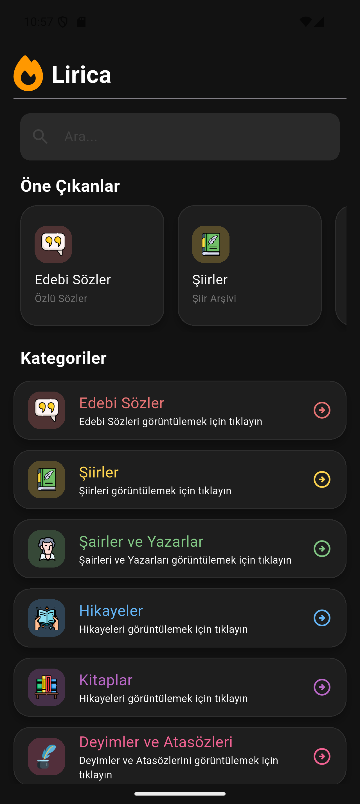
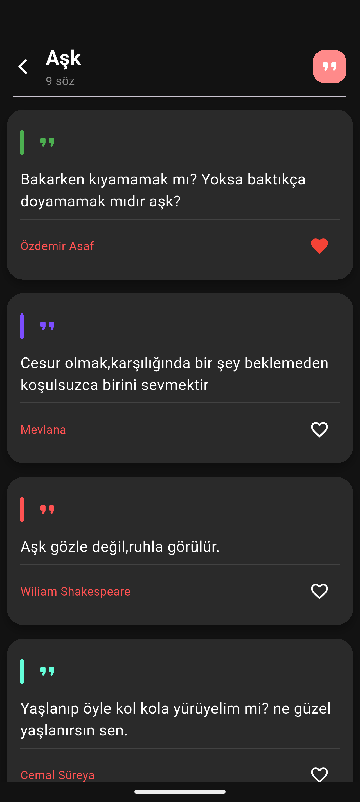
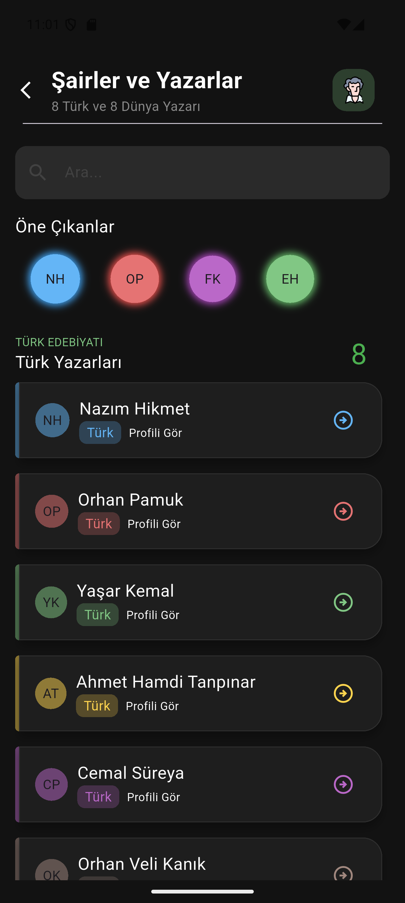
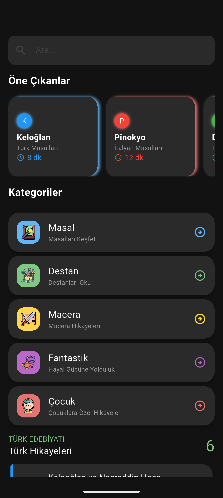
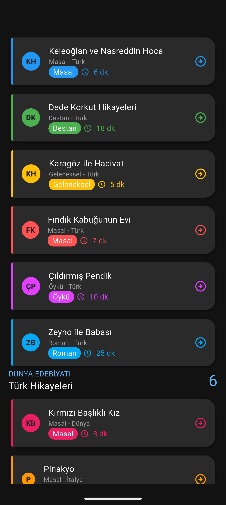
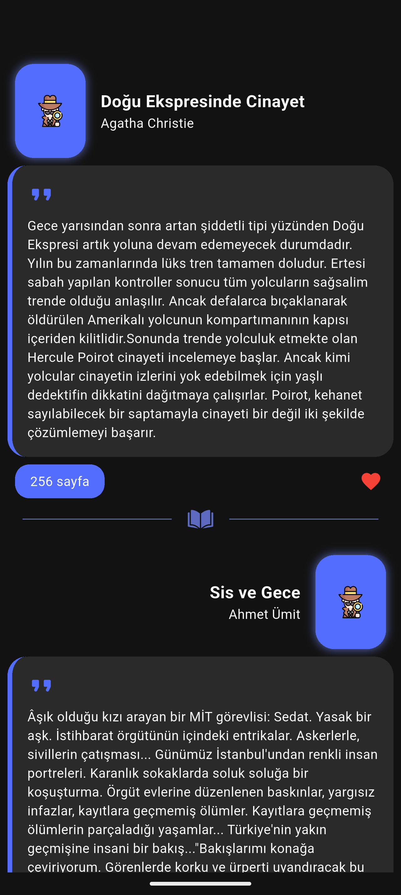

📖 Lirica

Lirica, edebi sözler, şiirler ve kısa düşünce metinlerini keşfetmeyi ve saklamayı sağlayan modern bir Flutter uygulamasıdır. Kullanıcılar günlük ilham verici sözleri görüntüleyebilir, favorilerine ekleyebilir ve kendi edebi koleksiyonlarını oluşturabilir.

---

✨ Özellikler

- 📜 Günlük rastgele edebi sözler
- 📚 Kategorilere ayrılmış içerikler (aşk, edebiyat, motivasyon vb.)
- ⭐ Favorilere ekleme ve yönetme
- 🎲 Random söz keşfetme
- 🔍 Basit arama sistemi
- 🌙 Dark / Light tema desteği
- 📤 Sözleri paylaşma özelliği
- 💾 Offline veri saklama (Hive)

---

🎯 Amaç

Lirica’nın amacı, kullanıcıya sadece söz göstermek değil; kısa ama anlamlı edebi içerikleri günlük hayatın bir parçası haline getirmektir.

---

🛠️ Kullanılan Teknolojiler

- Flutter
- Dart
- Hive (local database)
- Material Design

## Ekran Görüntüleri

### Ana Sayfası

### Sözler Sayfası

### Şiir Sayfası

### Story Sayfası

### Kitaplar Sayfası

### Favoriler Sayfası

