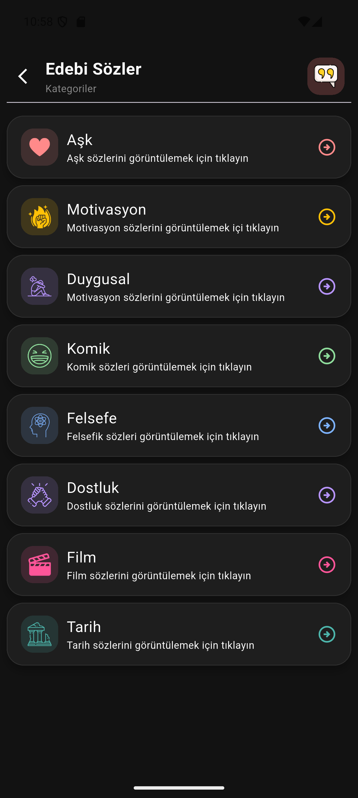
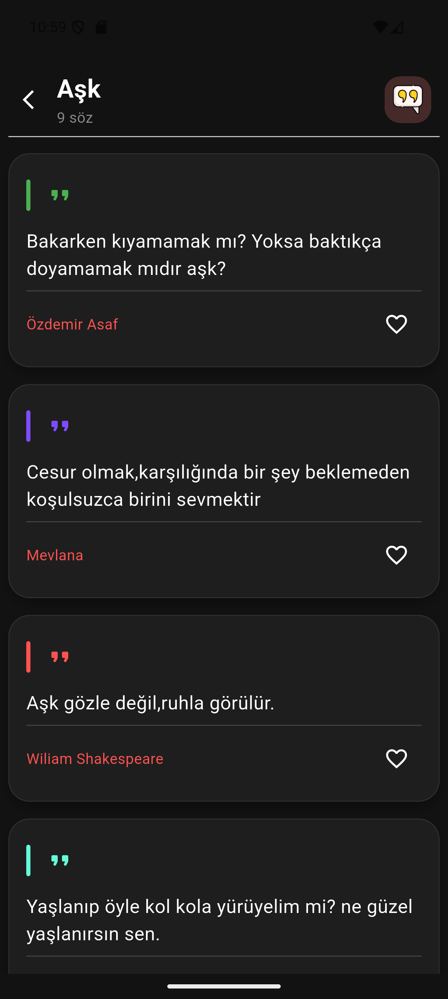
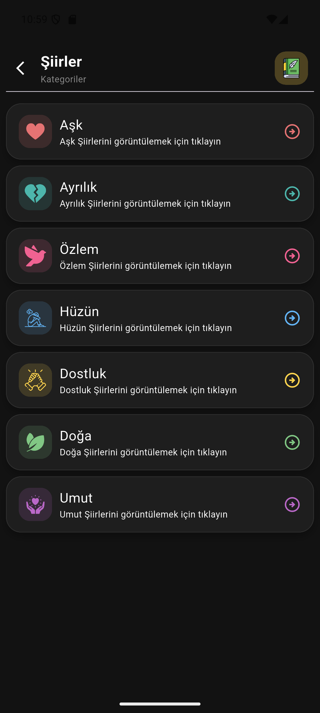
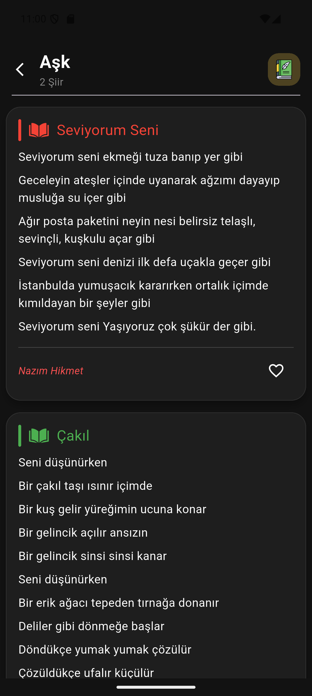
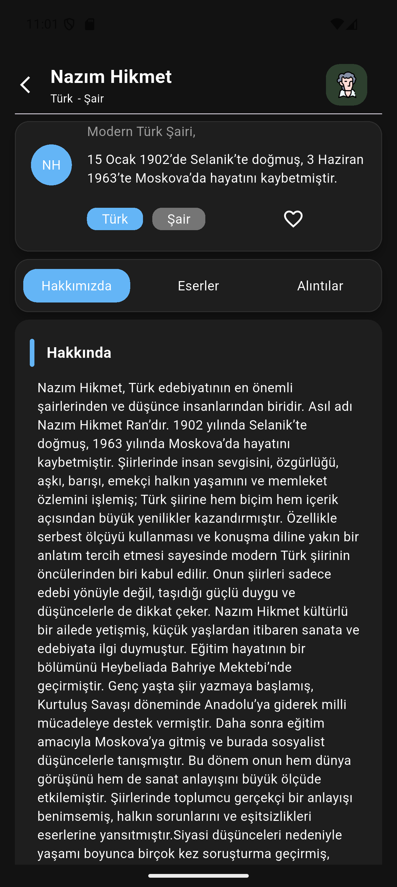
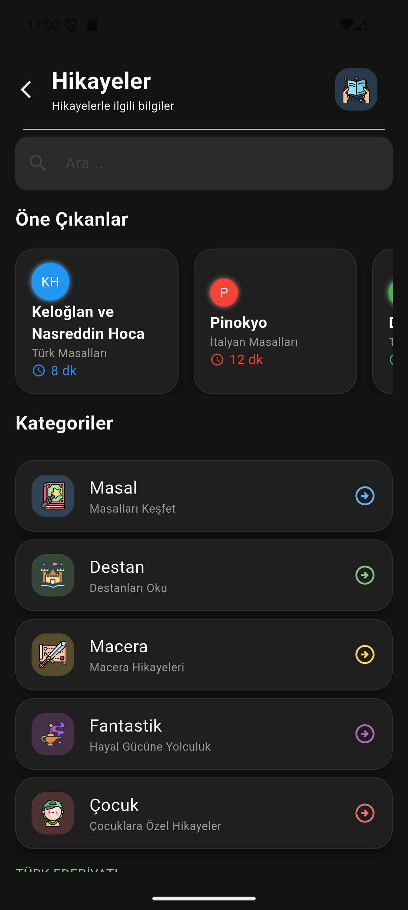
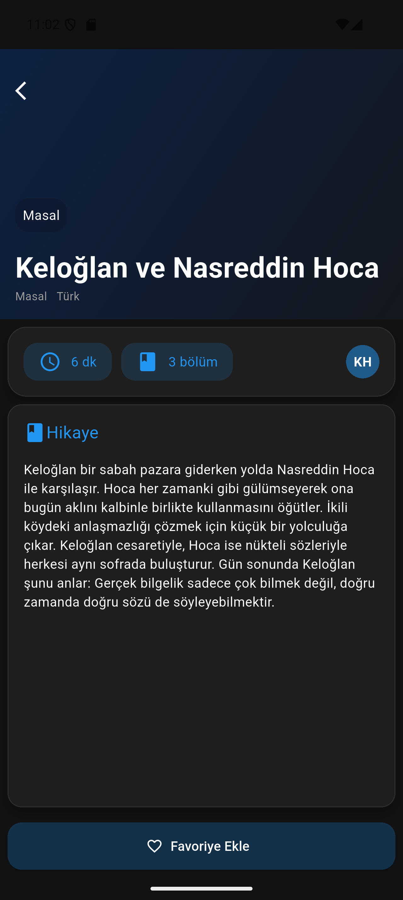
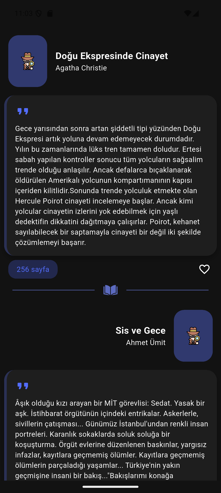
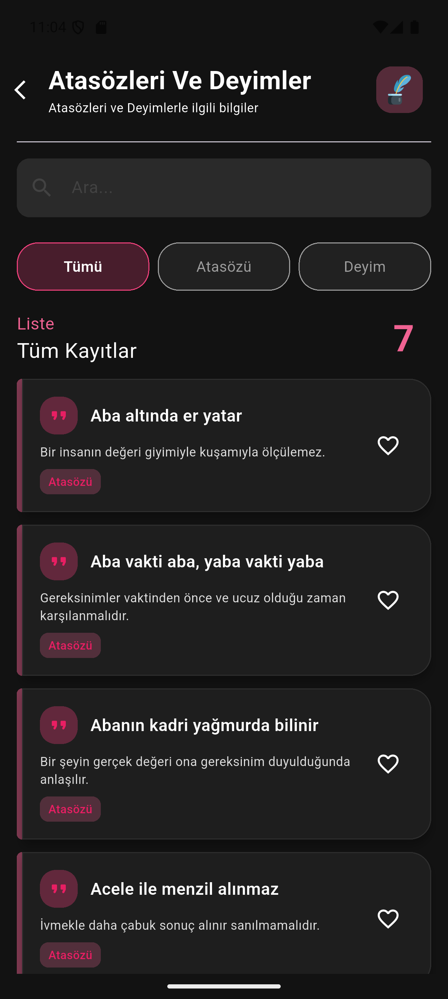
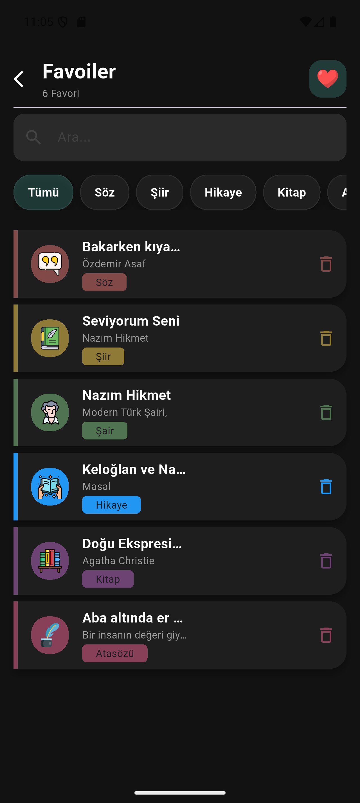

📖 Lirica

Lirica, edebi sözler, şiirler ve kısa düşünce metinlerini keşfetmeyi ve saklamayı sağlayan modern bir Flutter uygulamasıdır. Kullanıcılar günlük ilham verici sözleri görüntüleyebilir, favorilerine ekleyebilir ve kendi edebi koleksiyonlarını oluşturabilir.

---

✨ Özellikler

- 📜 Günlük rastgele edebi sözler
- 📚 Kategorilere ayrılmış içerikler (aşk, edebiyat, motivasyon vb.)
- ⭐ Favorilere ekleme ve yönetme
- 🎲 Random söz keşfetme
- 🔍 Basit arama sistemi
- 🌙 Dark / Light tema desteği
- 📤 Sözleri paylaşma özelliği
- 💾 Offline veri saklama (SharedPreferences)

---

🎯 Amaç

Lirica'nın amacı, kullanıcıya sadece söz göstermek değil; kısa ama anlamlı edebi içerikleri günlük hayatın bir parçası haline getirmektir.

---

🛠️ Kullanılan Teknolojiler

- Flutter
- Dart
- SharedPreferences (local database)
- Material Desig
- Object Orianted Programing

---

## 📸 Ekran Görüntüleri

<table align="center">
  <tr>
    <td align="center">
      <b>Ana Sayfası</b>  
      
    </td>
    <td align="center">
      <b>Sözler Kategori Sayfası</b>  
      
    </td>
    <td align="center">
      <b>Sözler Sayfasy</b>  
      
    </td>

  </tr>
    <tr>
    <td align="center">
      <b>Şiirler Kategori Sayfası</b>  
      
    </td>
    <td align="center">
      <b>Şiirler Sayfası</b>  
      
    </td>
    <td align="center">
      <b>Şairler Ve Yazarlar Sayfası</b>  
      
    </td>
  </tr>

  <tr>
    <td align="center">
      <b>Şairler Ve Yazarlar Detay Sayfası</b>  
      
    </td>
    <td align="center">
      <b>Hikaye Sayfası</b>  
      
    </td>
    <td align="center">
      <b>Hikaye Detay Sayfası</b>  
      
    </td>
  </tr>

   <tr>
    <td align="center">
      <b>Kitaplar Kategori Sayfası</b>  
      
    </td>
    <td align="center">
      <b>Kitaplar Detay Sayfası</b>  
      
    </td>
    <td align="center">
      <b>Deyimler Ve Atasözleri Sayfası</b>  
      
    </td>
  </tr>

  <tr>
    <td align="center">
      <b>Favori Sayfası</b>  
      
    </td>
  </tr>
</table>
